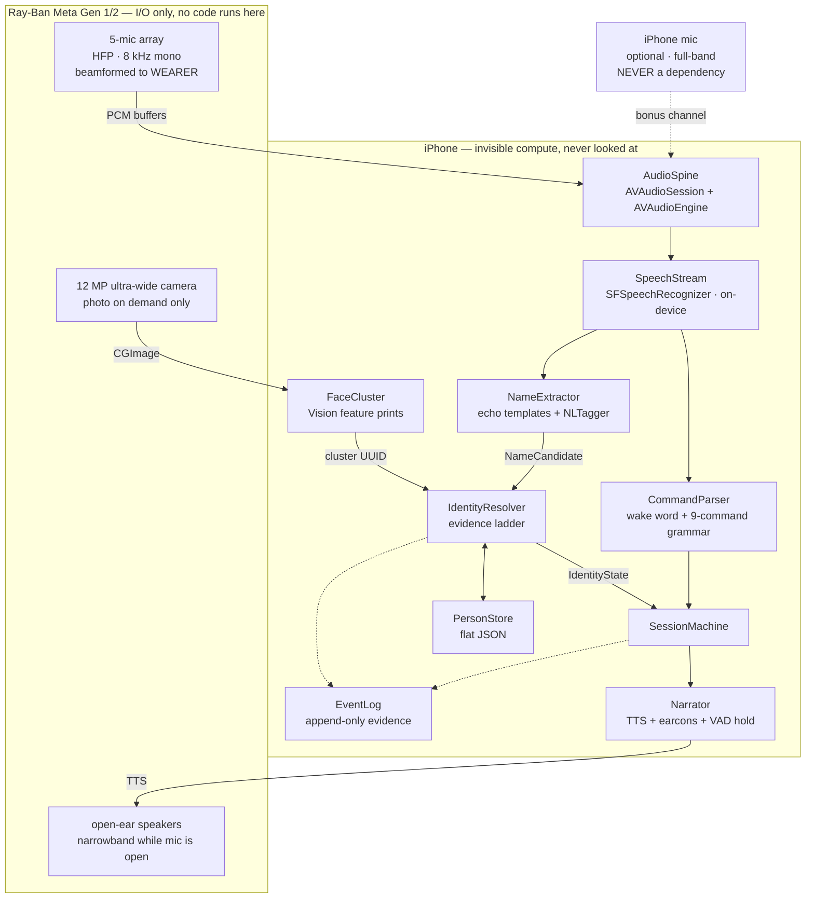
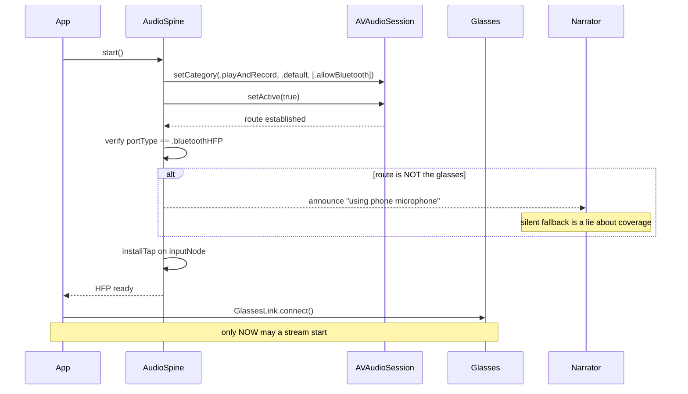
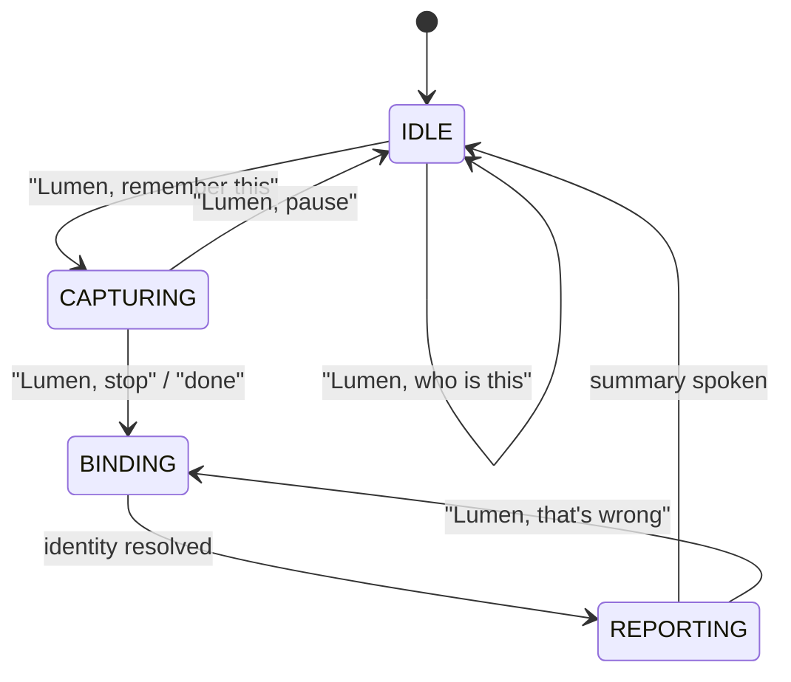
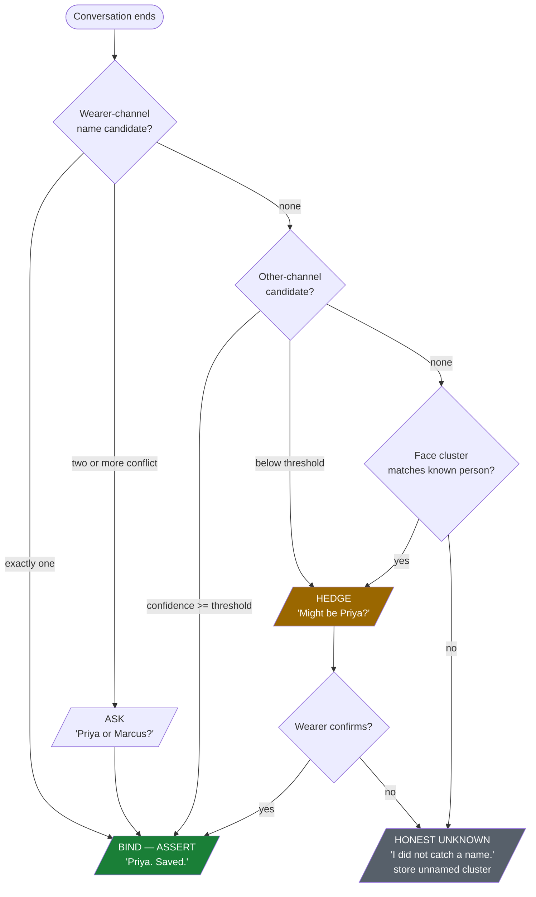
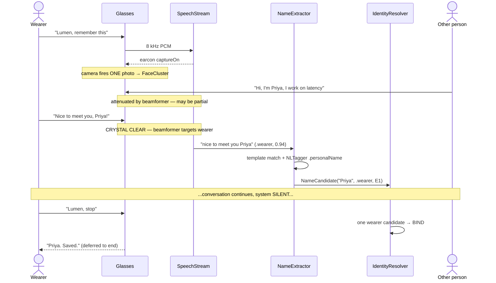
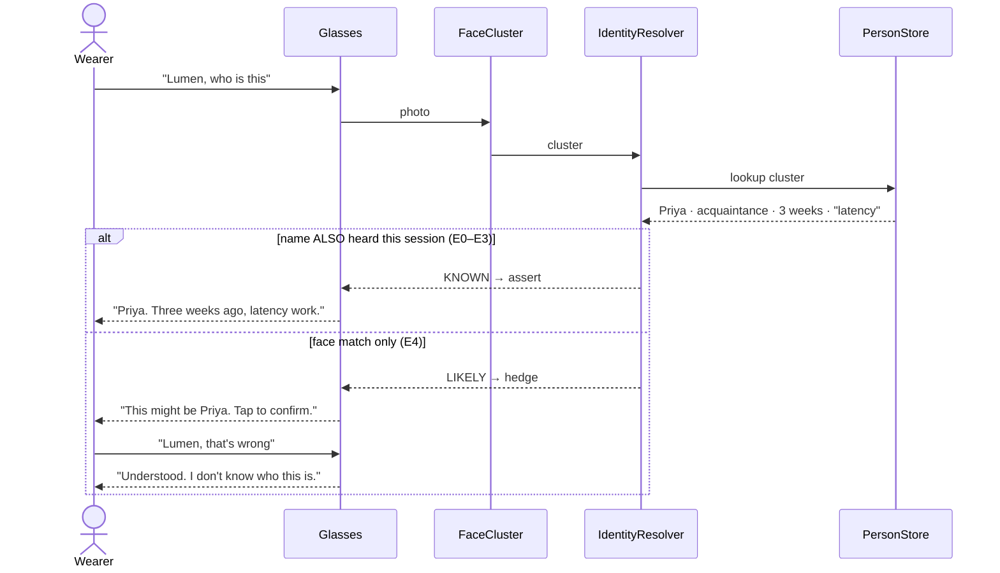
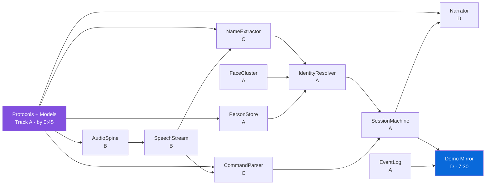

# Architecture

Companion to [`IMPLEMENTATION_PLAN.md`](./IMPLEMENTATION_PLAN.md). All diagrams render natively on GitHub.

**One-line summary:** the glasses are I/O only — no code runs on them. An iPhone in the pocket is the
invisible computer. Identity is bound from **names spoken aloud**, primarily the wearer's own natural
echo, because the mic array is engineered to capture the wearer and suppress everyone else.

---

## 1. System architecture



**Read the dotted lines carefully.** The phone mic is opportunistic enhancement — if it is absent or
muffled in a pocket, everything still works at full accuracy on glasses alone. `EventLog` is written
by every decision and is the evidence behind the zero-false-assertions claim.

---

## 2. Startup ordering — get this wrong and audio silently fails

Meta's docs require HFP to be **fully configured before** any stream that needs audio starts.



---

## 3. Conversation state machine



**Invariant:** exactly one state is active. Verification results may only occur in `BINDING`.
The Narrator is **silent** for the entire `CAPTURING` state — see §6.

---

## 4. Identity resolution — the decision that must never guess



| Level | Source | Channel | May assert? |
|---|---|---|---|
| **E0** | `"Lumen, this is Priya"` | wearer, explicit | ✅ unconditional |
| **E1** | Wearer echo — "Nice to meet you, Priya" | wearer, clear | ✅ **primary path** |
| **E2** | Self-introduction — "I'm Priya" | other, attenuated | ✅ if confident |
| **E3** | Third-party address — "Hey Marcus" | other, attenuated | ✅ if confident |
| **E4** | Face cluster match | camera | ❌ hedge only |
| **E5** | Topical similarity | transcript | ❌ hedge only |

**A face cluster never creates a name. It only ever attaches to one.**

---

## 5. Flow A — first meeting



The name is captured from the wearer, not from Priya. That inversion is the entire reliability story.

---

## 6. Flow B — re-encounter, and why hedging matters



The `else` branch is what keeps the accuracy claim true. **A hedge that is audibly a hedge is not a
false statement.** These strings are owned by Track D and gated by trials 10–12 — they are trivially
easy for someone to "improve" into assertions at hour 9.

---

## 7. Audio interaction wireframe

This is the real UI. There is no screen for the user.

```
┌──────────────────────────────────────────────────────────────────┐
│  FIRST MEETING                                                   │
├──────────────────────────────────────────────────────────────────┤
│  WEARER   "Lumen, remember this"                                 │
│  SYSTEM   ♪ rising two-tone            [captureOn earcon]        │
│                                                                  │
│  OTHER    "Hi, I'm Priya, I work on latency at Stripe"           │
│  WEARER   "Nice to meet you, Priya!"    ← identity captured HERE │
│                                                                  │
│  SYSTEM   ·············· silent for entire conversation ········· │
│                                                                  │
│  WEARER   "Lumen, stop"                                          │
│  SYSTEM   ♪ falling two-tone           [captureOff earcon]       │
│  SYSTEM   "Priya. Saved."               ← ≤ 2s, deferred to end  │
└──────────────────────────────────────────────────────────────────┘

┌──────────────────────────────────────────────────────────────────┐
│  RE-ENCOUNTER — tiered verbosity                                 │
├──────────────────────────────────────────────────────────────────┤
│  NEW (1st)        full capture path, consent required            │
│  ACQUAINTANCE     "Priya, Stripe. Three weeks ago, latency."     │
│  FAMILIAR (5+)    "Marcus. Tuesday, the budget."                 │
│  INNER (manual)   ♪ soft chime only — NEVER reads the full card  │
│                   + "You wanted to ask about the car."           │
└──────────────────────────────────────────────────────────────────┘

┌──────────────────────────────────────────────────────────────────┐
│  FAILURE MODES — all honest, none silent                         │
├──────────────────────────────────────────────────────────────────┤
│  no name heard     "I didn't catch a name."                      │
│  face match only   "This might be Priya. Tap to confirm."        │
│  glasses drop      ♪ URGENT descending  + "Glasses disconnected." │
│                    ← silent failure = user thinks room is empty   │
│  phone mic route   "Using phone microphone."                     │
└──────────────────────────────────────────────────────────────────┘
```

**Verbosity is inversely proportional to familiarity.** Announcing "This is your sister Sarah, you
met her 3 days ago" is insulting. Announcing a stranger's name is essential.

---

## 8. Phone screens

The wearer never looks at these. Two exist anyway, for different audiences.

```
   SETUP (once, sighted helper)          DEMO MIRROR (judges)
┌──────────────────────────┐      ┌──────────────────────────────┐
│  Omnivision              │      │  ● CAPTURING          02:14  │
│                          │      ├──────────────────────────────┤
│  Glasses      ● linked   │      │  TRANSCRIPT                  │
│  HFP route    ● 8kHz     │      │  [other]  "...I'm Priya, I"  │
│  Mic          ● granted  │      │  [WEARER] "Nice to meet you, │
│  Speech       ● on-device│      │            Priya!"           │
│  Camera       ● granted  │      ├──────────────────────────────┤
│                          │      │  EVIDENCE                    │
│  Wake word: "Lumen"      │      │  E1 wearer echo    "Priya"   │
│  ┌────────────────────┐  │      │     template: nice-to-meet   │
│  │   Test wake word   │  │      │     NLTagger: .personalName  │
│  └────────────────────┘  │      │     confidence: 0.94         │
│                          │      │  E4 face cluster #7  d=0.31  │
│  People stored:      12  │      ├──────────────────────────────┤
│  ┌────────────────────┐  │      │  DECISION                    │
│  │  Forget everyone   │  │      │  ► BIND — ASSERT             │
│  └────────────────────┘  │      │    "Priya. Saved."           │
└──────────────────────────┘      └──────────────────────────────┘
```

**The demo mirror is not optional, and the plan omitted it.** Judges cannot hear what is in the
wearer's ear. Without a screen showing the transcript, the evidence, and the assert-vs-hedge
decision, your entire accuracy story is invisible — the room just sees someone talking to sunglasses.
This screen is also how you *prove* zero false assertions rather than asserting it.

Build it in the 7:30–8:30 block. It is a read-only view over `EventLog`, so it costs almost nothing.

---

## 9. Module dependency and build order



**Everything depends on `Protocols.swift`.** That is why it ships at 0:45 and is frozen — it is the
only true serialization point in the whole build. After that, all four tracks run against mocks and
nobody waits for anybody.

---

## 10. What deliberately does not exist

| Not built | Why |
|---|---|
| Face **recognition** | Identity never comes from a face. Clusters are unlabeled until a name is spoken. |
| Voice biometrics | 8 kHz, beamformed away from the target — and voiceprints are BIPA-class biometric data. |
| Continuous video stream | Competes with HFP for Bluetooth bandwidth, degrading the audio everything depends on. |
| Cloud anything | On-device ASR; audio never leaves the phone. |
| A screen for the wearer | Tap zones and audio only. The wearer is blind or low-vision. |
| Emotion / tone inference | Unreliable, and not what differentiates people. |
